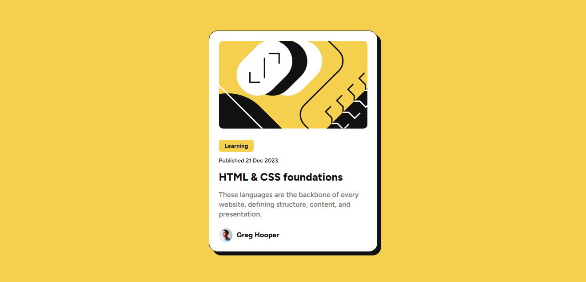

# Frontend Mentor - Blog Preview Card

Realizei meu segundo desafio usando o Frontend Mentor utilizando novamente Flexbox, o desafio realizado foi o [Blog Preview Card.](https://www.frontendmentor.io/challenges/blog-preview-card-ckPaj01IcS)

## Índice

- [Visão Geral](#visão-geral)
  - [Screenshot](#screenshot)
  - [Links](#links)
- [Meu Processo](#meu-processo)
  - [Tecnologias Utilizadas](#tecnologias-utilizadas)
- [Conclusão](#conclusão)

## Visão Geral
Assim como o desafio de QR Code, esse desafio tinha o objetivo deixar o layout o mais parecido possível apresentado pelo site.

### Screenshot

### Links

- Solução URL: [Solução](https://www.frontendmentor.io/solutions/blog-preview-card-com-flexbox-ao-FK3hGWS)
- Site do Blog Preview Card: [Blog Preview Card](https://msumii.github.io/desafio-blog-preview-card-frontend-mentor/)

## Meu Processo
Utilizei a mesma base do HTML do QR Code pois também se tratava de um card, mas utilizei um dos concelhos de um feedback que recebi onde eu poderia trocar a div por um main, pois assim ficaria algo mais semântico.

### Tecnologias Utilizadas

- HTML
- CSS
- Flexbox
- Git

## Conclusão
Mais uma vez o Frontend Mentor com fazem você pensar fora da caixa, principalmente para organizar os elementos de forma que fique uniforme para ser algo visivelmente agradável, continuarei fazendo mais desafios para me desafiar e irei postar aqui para ver o meu progresso.